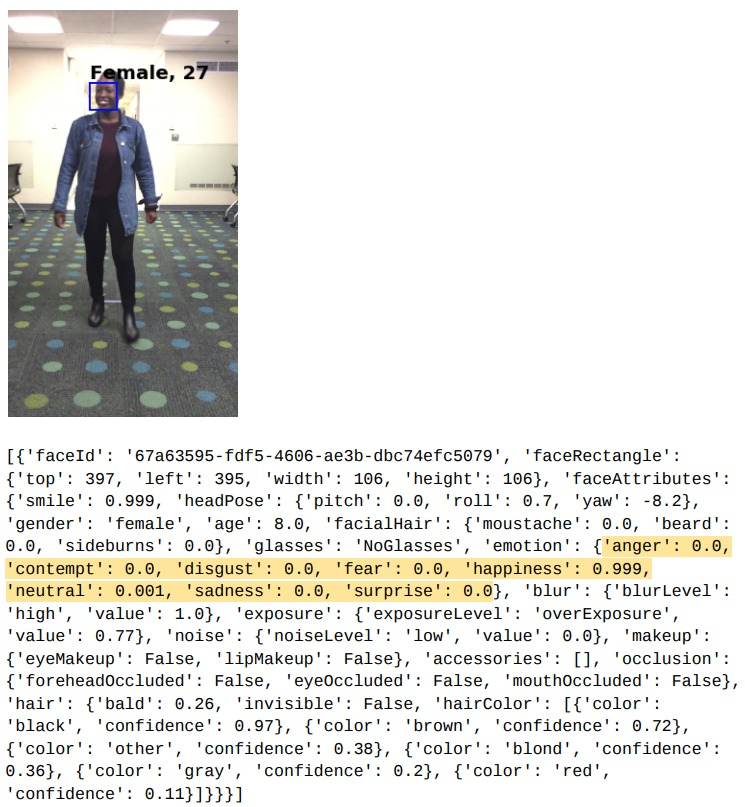

# Perceiving Human Emotions from Multiple Modalities: Face, Speech and Gait

## Problem Description

#### Problem Statement
The problem of understanding human emotions from facial expressions is a classical and well-studied problem in psychology and medicine. However, recent studies in the psychology literature have questioned the quick, automatic process of perceiving emotions from facial expressions alone. These studies point to other non-verbal cues such as vocal expressions, body postures and gait to deduce a person's emotional state more accurately. In fact, there is a whole body of human perception studies that support this claim. They are driven by the fact that in addition to facial expressions such as eye movements and facial muscle tautness and laxness, humans are also quick to perceive more diverse cues ranging from high or low voice pitch, curtness or loudness of tone, to body movements including relative position and orientation of body joints and overall walking speed.

In this project, we propose to develop an AI that attempts to draw the same perceptive conclusions as humans using three such non-verbal cues or "modalities": facial expressions, speech (or voice) and gait. Specifically, we aim to develop a supervised DNN architecture that incorporates the following functionality:

* **Input data.** Input data consists of the three modalities: face, speech and gait. Faces are given as RGB images, speech as audio files and gait as a temporal sequence of skeletal structures with 16 key joints. **We are aware that a dataset with all three modalities together is not available. We plan to use separate input data coming from three different sources.** 
* **Input labels.** For the limited scope of this project, we plan to use only four broad emotion labels: happy, sad, angry and neutral.
* **Output.** The predicted emotion label of a given input data point. This takes into account the relative weights the network assigns to each of the input modalities during training.

#### Motivation
An emotion-aware AI, especially deployed through an interactive robotic system, has a wide variety of applications. 
* People tend to interact very differently with someone they perceive to be angry or hostile compared to how they behave with someone their perceive to be calm or docile. This is even more relevant and important when a person interacts with unknown individuals and has to understand their emotion without any prior familiarity. For example, a shopping assistant engaging with a potential customer has to understand whether the customer is rude and aggressive or friendly and cooperative to make effective sales. Thus, it is useful for an AI assistant to possess a similar richness of interaction capabilities.
* Adding such capabilities can help create more "human-like" characters in, for example, AI-based games.
* Generalizing this idea, emotion-aware AIs can be used to develop more "human-like" personal digital assistants or humanoid robots that can possibly carry out conversations with humans and even provide emotional support. The [Pepper Robot](https://www.youtube.com/watch?v=K5KXGszMwMI) is an exciting step in this direction.

#### Challenges
* To the best of our knowledge, there exists no dataset that simultaneously contains face, speech and gait data of a human subject and the associated emotion labels. There are, however, a wide range of separete datasets for faces and speech, and even for faces and speech together, with emotion labels.
* There are datsets containing a variety of human gaits, but we did not find one that also has associated emotion labels.
* Cross-modality of face and speech for emotion detection is relatively well-studied in computer vision. However, cross-modality studies with gait data also included are non-existent.

## Proposed Approach
**Face and Speech**
* Familiarize ourselves with the SOTA models for emotion detection from face, speech and cross-modality of face and speech.
* Improve on the SOTA with novel techniques and sophisticated models to better exploit the existing datasets, especially the more recent ones.

**Gait**
* We have an internally collected dataset of human gaits annotated with emotion labels. However, this dataset currently only has 342 distinct data points due limited resources for data collection. Hence, we plan to develop a generative network, based on LSTM or Graph Convolution or a combination of both, to create synthetic gaits that can be reliably used for emotion detection.
* Use a supervised or semi-supervised classifier, again based on LSTM or Graph Convolution or a combination of both, to classify both the real and the synthetic gait data.
* A key purpose of this exercise is to understand the saliency of different parts of the gait input data for emotion detection and thereby attempt to provide an intuitive interpretation of the classifier. In other words, we want to ensure that the classifier learns to perform actual classification and not simply memorize the dataset.

**Cross Modality**
* Assuming we have models in place to detect emotions from each of the individual modalities, we plan to study these models as well as explore the psychology literature to come up with a verifiable procedure for fusing the modalities. Roughly speaking, we will aim to design a hybrid feature $$ Feature_{hybrid} = w_{face}Feature_{face} \bigoplus w_{speech}Feature_{speech} \bigoplus w_{gait}Feature_{gait} $$, where $\bigoplus$ stands for fusing, and $w_x$ is the weight attributed to the feature from modality $x$.
* Our eventual plan is to make all the $w_x$ weights learnable.
* Based on our literature review, we will be employing ensemble learning, with either **late fusion** techniques that combine final outputs from the three modalities to get the final output, or **early fusion** techniques that combine the feature representations given by the three networks (one per modality) into a single feature vector and pass that feature vetor through subsequent layers before getting the final output.
We also plan to incorporate the idea of multiplicative combination of input from different modalities. The idea behind is that it is possible that a particular sample point has more informative features from one particular modality (e.g., for a particular sample, most of the information can be contained in the face as compared to speech or gait). The network in this case learns to distinguish a strong modality from a weak modality for a given sample. This idea was used in [this paper](https://arxiv.org/pdf/1805.11730.pdf).

## Related Work
There is a wide body of work, both on developing datasets and methods, for emotion detection from face and speech and their cross-modality. Since providing a comprehensive summary of all existing work is out of scope for this project, we only highlight some of the recent and well-known work in this section that are most relevant to our objectives. Our list is by no means exhaustive.

#### Datasets
**Face Datasets**
* [Labeled Faces in the Wild (LFW)](http://vis-www.cs.umass.edu/lfw/).
* [Indian Movie Face Database (IMFDB)](http://cvit.iiit.ac.in/projects/IMFDB/).
* [Wikipedia](https://en.wikipedia.org/wiki/Facial_expression_databases) also has a comprehensive list of commonly used face datasets with emotion labels.

**Speech Datasets**
* [The Ryerson Audio-Visual Database of Emotional Speech and Song (RAVDESS)](https://smartlaboratory.org/ravdess).
* [Toronto Emotional Speech Set (TESS)](https://tspace.library.utoronto.ca/handle/1807/24487).
* [A comprehensive survey paper of 32 speech datasets with emotion labels](http://delab.csd.auth.gr/bci1/Panhellenic/560ververidis.pdf).  

**Face and Speech Datasets**  
* [IEMOCAP Dataset](https://sail.usc.edu/iemocap/)
* [eNTERFACE Dataset](https://ieeexplore.ieee.org/stamp/stamp.jsp?tp=&arnumber=1623803)
* [RML Dataset](https://emotion-database.github.io/RML_Emotion_Database/)
* [EMOVOXCELEB Dataset](http://www.robots.ox.ac.uk/~vgg/data/voxceleb/)

**Gait Datasets (without emotion labels)**
* [CMU MoCap](http://mocap.cs.cmu.edu/). Contains 6 motion categories and 23 subcategories.
* [Human3.6M](http://vision.imar.ro/human3.6m/description.php). Contains 3.6 million data points and 17 categories.
* [Style Translation Dataset](http://people.csail.mit.edu/ehsu/work/sig05stf/). Used for human motion style translation.

#### Methods
**Face**
* [Learning Supervised Scoring Ensemble for Emotion Recognition in the Wild](http://delivery.acm.org/10.1145/3150000/3143009/icmi17-sl-2037.pdf?ip=128.8.120.4&id=3143009&acc=ACTIVE%20SERVICE&key=5F8E7AA76238C9EB%2E737F10F6E50A862B%2E4D4702B0C3E38B35%2E4D4702B0C3E38B35&__acm__=1551477572_90bb4645b0d7881258502c4ff7fcc3bf), ICMI 2017. Uses a supervised scoring ensemble of CNNs to predict final emotion labels. Winner of [EmotiW'17](https://sites.google.com/site/emotiwchallenge/).
* [Video-Based Emotion Recognition using CNN-RNN and C3D Hybrid Networks](https://www.researchgate.net/profile/Yuanliu_Liu3/publication/308453418_Video-based_emotion_recognition_using_CNN-RNN_and_C3D_hybrid_networks/links/59eea7840f7e9b369575ac1a/Video-based-emotion-recognition-using-CNN-RNN-and-C3D-hybrid-networks.pdf), ICMI 2016. Uses a hybrid network of RNNs and 3D CNNs to predict emotion labels.

**Speech**
* [Adieu Features? End-to-end Speech Emotion Recognition Using a Deep Convolutional Recurrent Network](https://ieeexplore.ieee.org/stamp/stamp.jsp?tp=&arnumber=7472669) ICASSP 2016. Uses CNNs and LSTMs to extract 'context-aware' emotional relevant features and perform end-to-end speech emotion recognition.
* [Semisupervised Autoencoders for Speech Emotion Recognition](https://ieeexplore.ieee.org/stamp/stamp.jsp?tp=&arnumber=8059872), IEEE/ACM Transactions on Audio, Speech, and Language Processing, Jan 2018. Uses semi-supervised autoencoders to perm emotion detection with a small number of labeled speech data and a large collection of unlabeled speech data.

**CrossModality**
* [Convolutional MKL Based Multimodal Emotion Recognition and Sentiment Analysis](https://ieeexplore.ieee.org/stamp/stamp.jsp?tp=&arnumber=7837868), ICDM 2016. Performs emotion recognition from audio, visual and text inpute. It uses Deep CNNs for audio, MKL for images and FC layers for text, and fuses the learned features from the three networks together to perform final prediction.
* [Emotion Recognition in Speech using Cross-Modal Transfer in the Wild](https://arxiv.org/pdf/1808.05561.pdf), arXiv paper, dated Aug 16, 2018. Uses separate CNNs to detect emotion labels for face and speech data from the same video. The face CNN is pretrained while the speech CNN is learnable. Following this, it distilles (fuses) the labels from both netowrks to predict the final label for the video. An additional benefit of this approach is that the network also learns to label unlabeled speech data.

## Initial Experiments
#### Faces
We used the Microsoft Cognitive Services API (2016) to obtain some baseline off-the-shelf results. In addition to one-hot emotion recognition across 8 classes, the API also identifies the gender, age and important facial features of the subject. A snapshot of one such result is shown in the following figure.

